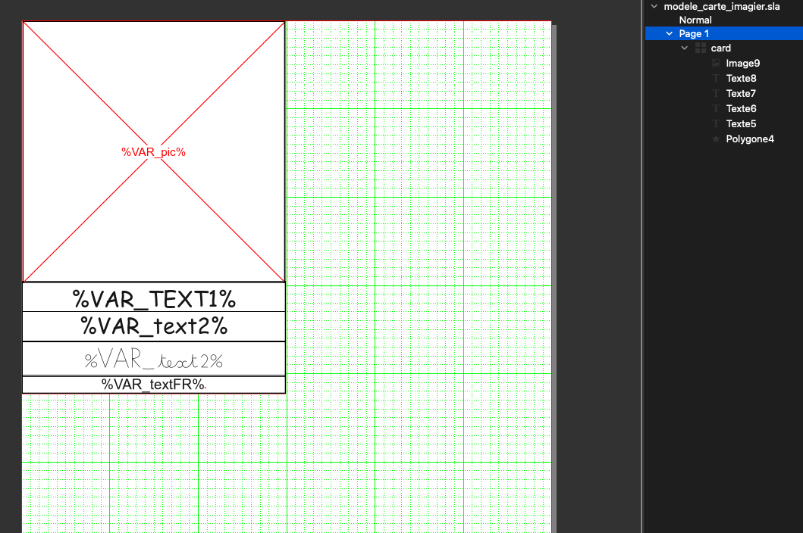
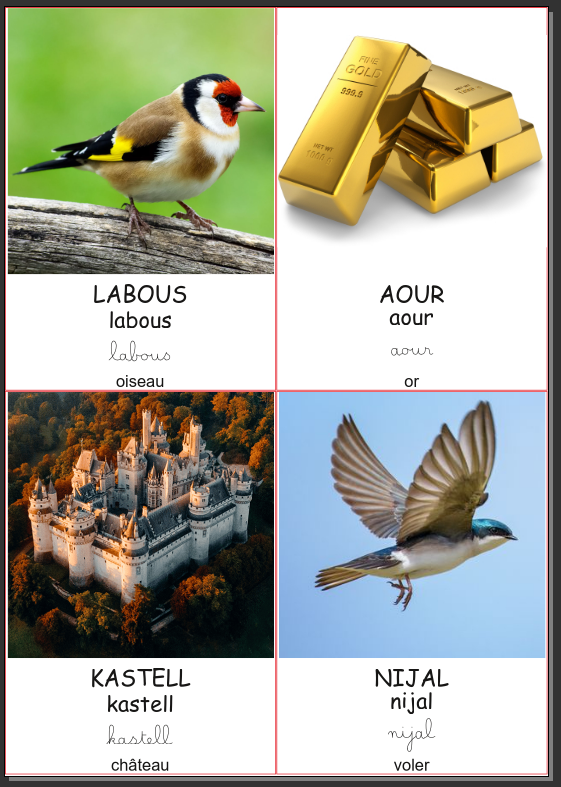

# Script de génération de flash cards

Ce script a pour objectif de simplifier la création de flash cards utilisées pour l'apprentissage de mots de vocabulaire.
Il se base sur un fichier de modèle Scribus qui peut être modifié comme vous le souhaitez à condition de respecter les points suivants :
 - les éléments du modèle qui seront à remplir automatiquement doivent contenir un texte de la forme

    > %VAR_***nom de la variable***%

 - une même variable peut être utilisée dans des éléments différents,
 - il peut y avoir plusieurs cadres d'image mais un seul contenant une variable qui sera à mettre dans le nom du fichier de ce cadre d'image.

 Le script utilise également un fichier CSV, avec le point virgule comme séparateur, permettant de renseigner la valeur des variables du modèle pour chacune des cartes.
 Par exemple :

> TEXT1;text2;textFR;pic
>
> LABOUS;labous;oiseau;labous.webp
>
> AOUR;aour;or;aour.jpg
>
> KASTELL;kastell;château;kastell.png
>
> NIJAL;nijal;voler;nijal.jpg

 La première ligne doit contenir un nom de variable du modèle par colonne, puis chacune des lignes suivantes contiendra la valeur de chacune de ces variables pour les cartes à générer.

 Au lancement du script, une boîte de dialogue apparaît afin de savoir si vous souhaitez générer des cartes à partir d'un tel fichier CSV ou si vous souhaitez en créer un.

 

 Si vous lancez la création d'un fichier CSV, le script vous demandera :
  - de choisir un dossier dans lequel se trouvent les images,
  - de choisir ensuite un emplacement et un nom pour le fichier CSV à créer.

Le fichier créé contient une première ligne avec les variables trouvées dans le modèle suivie d'autant de lignes que d'images dans le dossier.
  Le script a le comportement suivant :
   - le nom de l'image sert à remplir les valeurs des variables en remplaçant les caractères souligné (`_`) par un espace,
   - si le nom de la variable est en majuscule, la valeur est mise également en majuscule,
   - si le nom de la variable se termine par ***FR***, le contenu est laissé vide

Ce dernier comportement est dû au fait que ce script est fait à l'origine pour l'apprentissage bilingue. L'idée étant que la carte présente le mot dans une langue autre que le français, en majuscule, puis en minuscule et enfin la traduction en français.
Le fichier ainsi créé contient toutes les données dans la langue cible (à condition que le nom de l'image soit dans cette langue) et il ne reste plus qu'à renseigner la traduction en français pour chaque mot.

Pour la création de cartes, le script demande le fichier CSV à charger.
Le modèle est copié puis placé en priorité de façon à remplir la page horizontalement. S'il n'y a pas assez de place sur la ligne, le script place la nouvelle carte sous la ligne actuelle et s'il n'y a pas assez de place verticalement sur la page, une nouvelle page est commencée.

 

Si une carte doit être modifiée manuellement, il faut au préalable dégrouper ses éléments (avec Scribus, les éléments d'un groupe ne peuvent pas être modifiés).

Il ne reste plus qu'à imprimer et couper les cartes.
