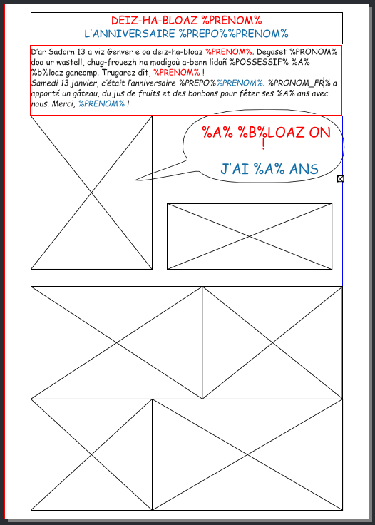
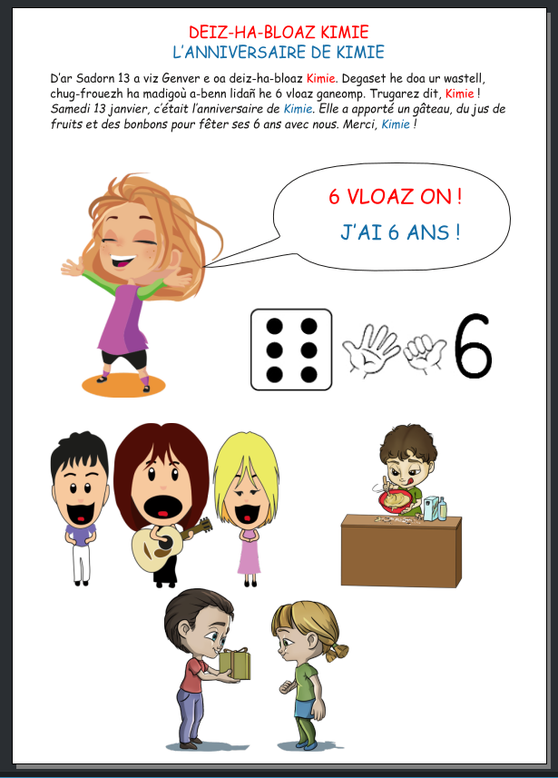

# Fiche d'anniversaire (vie de classe)
L'objectif de ce script est de réaliser rapidement un texte accompagné de photos pour illustrer la vie de classe lors de l'anniversaire d'un élève (entre 3 et 6 ans).
Le principe est de partir d'un modèle de document Scribus (le fichier anniversaire.sla) et de lancer le script `anniversaire.py`.

Le document est composé d'un titre, d'un texte et de cadres d'images. Le titre et le texte contiennent des variables qui seront remplacées par le prénom et l'âge de l'élève :
  - %PRENOM% sera directement remplacé par le prénom,
  - pour la partie en français, %PREPO% sera remplacé par la préposition ***"de"*** ou ***"d'"***, suivant que le prénom commence par une voyelle (ou un h) ou non,
  - pour la partie en français, %PRONOM_FR% sera remplacé par ***"Il"*** ou ***"Elle"*** suivant que le prénom est masculin ou féminin,
  - pour la partie en breton, %PRONOM% sera remplacé par ***"he"*** ou ***"en"***  suivant que le prénom est masculin ou féminin,
  - pour la partie en breton, %POSSESSIF% sera remplacé par ***"he"*** ou ***"e"*** suivant que le prénom est masculin ou féminin,
  - %A% sera remplacé par l'âge,
  - %B% sera remplacé par la lettre ***b*** ou ***v*** suivant l'âge afin de tenir compte de la mutation en breton (bloaz ou vloaz).

Le script commencera par afficher une boîte de dialogue permettant de saisir le prénom de l'élève, puis une autre boîte de dialogue permettant d'indiquer s'il s'agit d'un garçon ou d'une fille et une dernière pour saisir l'âge. Le script étant pensé pour une classe de maternelle, seul les chiffres 3, 4, 5 ou 6 peuvent être saisis.

À la fin de l'exécution du script, le document aura les variables remplacées et un des cadres d'image représentant l'âge sous plusieurs formes sera rempli.
Il ne restera plus qu'à mettre une photo de l'élève dans le cadre d'image à gauche de la bulle et compléter par d'autre photos en dessous (le nombre et le positionnement des cadres seront à adapter en fonction des photos à mettre).

 

