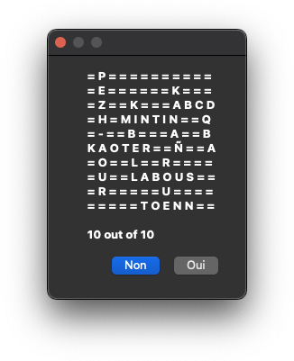
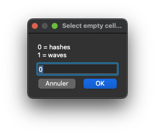
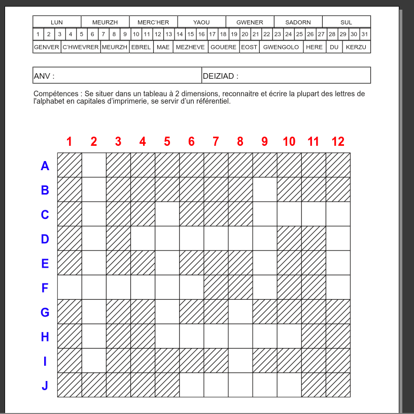
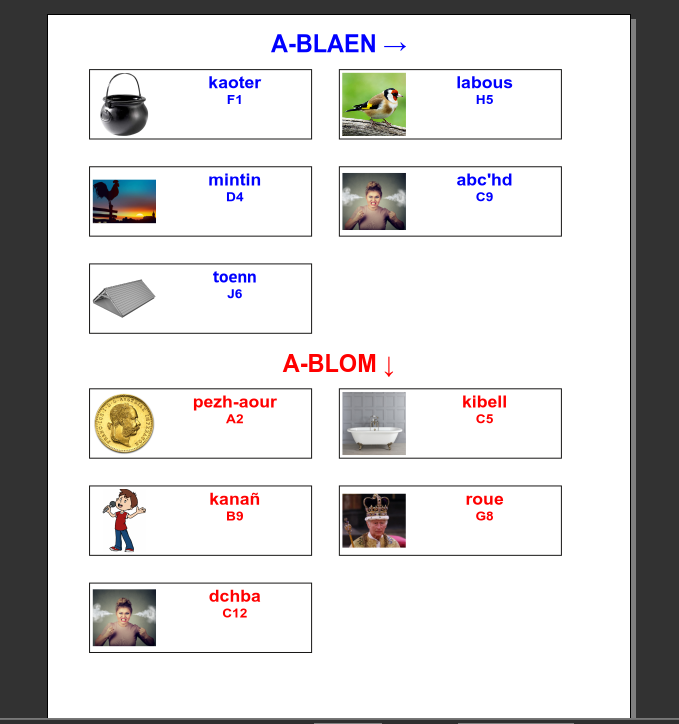

# Mots fléchés

Ce script est une adaptation de celui de David Whitlock [https://github.com/riverrun/genxword](https://github.com/riverrun/genxword).
Il a été adapté pour un usage en classe de maternelle et pour la gestion de la langue bretonne dont l'alphabet est un peu différent de l'alphabet français. Notamment, les chaînes de caractères ***ch*** et ***c'h*** sont considérées comme une seule lettre.

Le script peut être lancé sur un document vide en mode portrait ou sur le modèle de document avec entête (modele_portrait.sla) qui se trouve à la racine du projet.
Avant de lancer le script, il faudra préparer un dossier contenant les images illustrant les mots à utiliser et un fichier au format texte contenant pour chaque ligne le mot à utiliser suivi du caractère égale (`=`) et l'emplacement du fichier image correspondant (chemin relatif à l'emplacement du fichier texte).

Les premières lignes du fichier peuvent contenir certaines informations à utiliser lors de la génération du document :
 - ***wordFont=*** suivi du nom exact de la police à utiliser pour la liste des mots,
 - ***wordSize=*** siuvi de la taille de la police à utiliser pour la liste des mots. Le nombre à mettre est le même que celui qui serait mis manuellement pour le cadre de texte dans Scribus,
  - ***isBZH=true*** pour gérer l'alphabet breton (non géré si la ligne n'est pas présente)

Cela donne par exemple :

> wordFont=Belle Allure GS Gras
>
> wordSize=14
>
> isBZH=true
>
> kanañ=kanan.png
>
> kaoter=kaoter.jpg
>
> kibell=kibell.jpg
>
> labous=labous.webp

Ou encore

> isBZH=true
>
> kanañ=kanan.png
>
> kaoter=kaoter.jpg
>
> kibell=kibell.jpg
>
> labous=labous.webp

Une fois lancé, le script fera une proposition de grille dans une boîte de dialog. La grille est représentée sous forme texte avec le caractère `=` pour les cellules vides de la grille. Si la proposition est satisfaisante, il suffit de l'accepter en cliquant sur le bouton *Oui* sinon le bouton *Non* lancera une nouvelle proposition.

Lorsqu'une proposition est acceptée, une nouvelle boîte de dialogue permet de choisir le motif à utiliser pour remplir les cellules vides de la grille. Actuellement deux choix sont possibles, des hachures ou un motif en forme de vagues.

Le script génère alors la grille finale et la liste de mots à y placer. Cela peut prendre un certain temps suivant le nombre de mots et la puissance de l'ordinateur. La barre de progression de Scribus (en bas à droite de la fenêtre principale) est mise à jour avec la progression de la génération de la grille.

Une fois terminé, la première page contient la grille de mots à remplir et la seconde page la liste des mots avec les emplacements dans la grille.

Les indications d'orientation des mots (horizontal ou vertical) sont écrites en breton si la gestion de la langue bretonne a été activée dans le fichier CSV.

