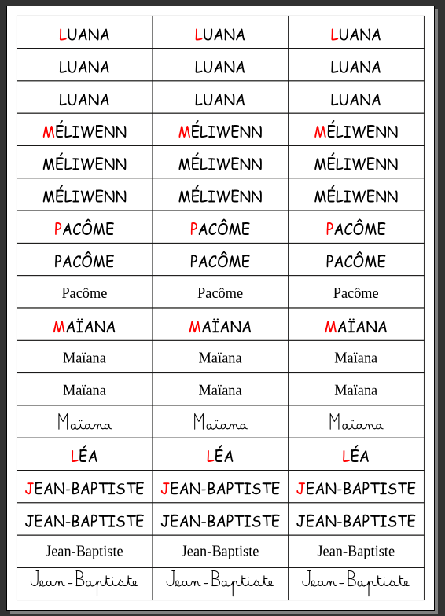

# Script de création d'étiquettes

Ce script permet la création d'une liste d'étiquettes de prénoms en utilisant plusieurs polices pour chaque prénom.
Même si ce script a été fait initalement pour des prénoms, rien n'empêche de l'utiliser pour d'autres usages...

Il se lance sur un document vide, plutôt au format A4.
Une fois le script lancé, une boîte de dialogue s'affiche permettant de sélectionner le fichier CSV contenant les informations utiles à la création de la liste.

Ce fichier CSV contient autant de ligne qu'il y a de prénoms et chaque ligne est construite avec le prénom, suivi d'un point virgule (séparateur utilisé pour le fichier CSV) et d'une série de lettres dont la signification est la suivante :
 - a : prénom écrit en capitales avec la première lettre écrite en rouge (le reste en noir)
 - b : prénom écrit en capitales noires
 - c : prénom écrit en minuscules script
 - d : prénom écrit en minuscules cursives

 Chaque type d'étiquette sera généré en trois exemplaires.

 ***Attention*** pour les minuscules cursives, le script utilise la police *Belle Allure GS Gras*. Si elle n'est pas trouvée une autre police sera utilisée par défaut mais qui ne donnera pas d'écriture cursive.
La police peut être téléchargée ici : [https://fr.fonts2u.com/belle-allure-gs-gras.policet](https://fr.fonts2u.com/belle-allure-gs-gras.police)

Voici un exemple de fichier CSV :

> Luana;abb
>
> Méliwenn;abb
>
> Pacôme;abc
>
> Maïana;accd
>
> Léa;a
>
> Jean-Baptiste;abcd
>

La génération du document peut prendre un certain temps suivant le nombre de prénoms, d'étiquettes par prénom et la puissance de l'ordinateur. La barre de progression de Scribus (en bas à droite de la fenêtre principale) est mise à jour avec la progression de la génération du document.

Voic le résultat pour l'example précédant :

Pour changer la police utilisée, il suffit de changer dans le script la portion de code suivante pour y remplacer le nom des polices et leur taille :

>self.fontName="Comic Sans MS Regular"
>
>self.fontsize = 20.0
>
>match letterCode:
>
>   case "a":
>
>       self.isUpper=True
>
>       self.hasFirstLetterColored = True
>
>   case "b":
>
>       self.isUpper=True
>
>   case "c":
>
>       self.fontName="Liberation Serif Regular"
>
>   case "d":
>
>       self.fontName="Belle Allure GS Gras"
>
>       self.fontsize = 18.0
>

L'API scribus ne permet pas simplement de choisir une police avec une boîte de dialogue, le script sera améliorer lorsque cela sera possible de le faire.
