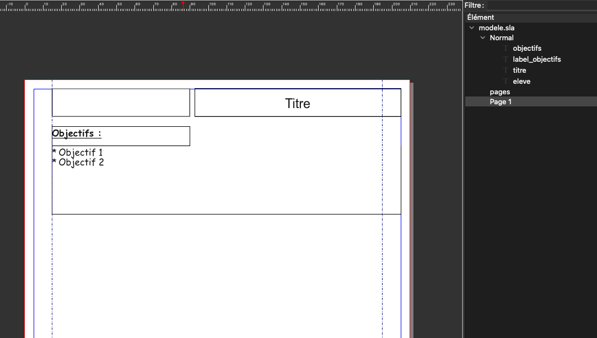
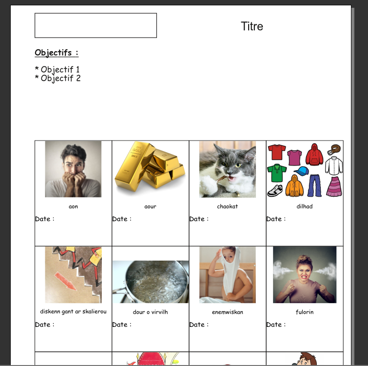

# Fiche de suivi d'atelier
L'obejctif de ce script est de réaliser rapidement une fiche de suivi d'atelier en classe de maternelle.
Le principe est de partir d'un modèle de document Scribus (le fichier modele.sla) et de lancer le script `fiches_suivi_ateliers.py`.

L'entête du document, qui correspond au gabarit par défaut du fichier Scribus, est à modifier afin d'y saisir les informations liées à l'activité. Il est composé de :
  - un cadre texte laissé vide qui permettra d'écrire à la main le nom de l'élève,
  - un cadre de titre à modifier pour saisir le nom de l'activité,
  - un cadre de texte pour saisir la liste des objectifs de l'activité. La hauteur de ce cadre sera à modifier en fonction du nombre d'objectifs saisis.

Le script commencera par afficher une boîte de dialog permettant de sélectionner un dossier contenant des images.
Chaque image du dossier correspond à une activité de l'atelier, le nom du fichier sera repris par le script en remplaçant les caractères soulignés (`_`) par des espaces et sera utilisé comme nom de l'activité.
Le script demandera ensuite s'il faut afficher le nom de chaque activité.

À la fin de l'exécution du script, s'il n'y a pas eu des erreurs, le document sera complété avec une grille contenant pour chaque activité :
 - l'image correspondante,
 - le nom de l'activité issu du nom du fichier image si cela a été demandé,
 - un cadre de texte contenant le label *Date :* suivi d'assez de place pour écrire à la main la date de réalisation de l'activité
 - un espace vide pour écrire à la main un éventuel commentaire

 

L'entête n'est présente que sur la première page. Les pages impaires ont une marge plus grande à gauche tandis que les pages paires ont une marge plus grande à droite. Cela permet de trouer les feuilles afin de les ranger dans un classeur tout en utilisant un maximum de l'espace de la page.

*** À faire : utiliser les repères du document dans le script pour gérer les marges plutôt que de les avoir en dur ***

