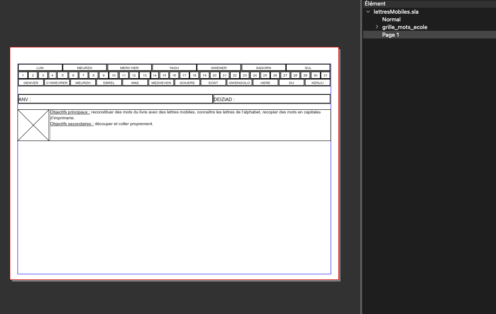
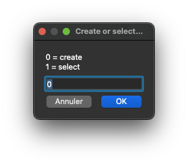
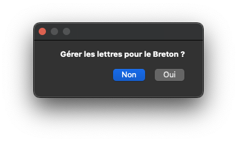
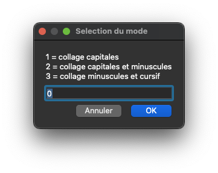
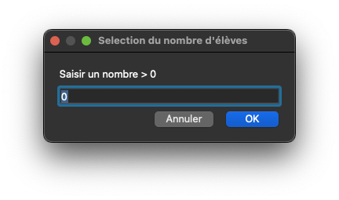
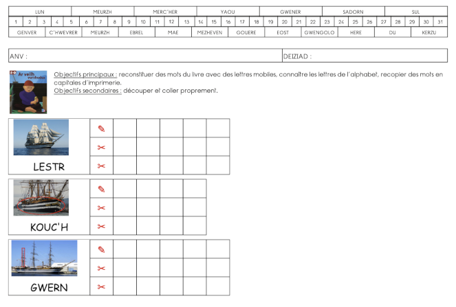
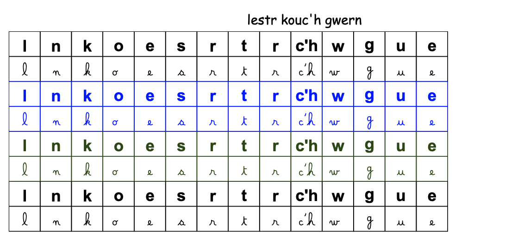
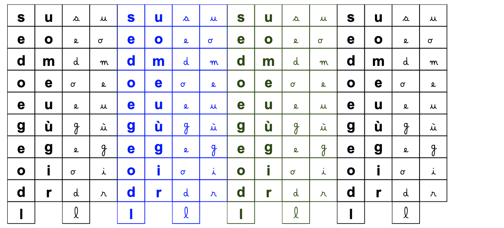

# Activité d'apprentissage de lecture et d'écriture
Ce script utilise une liste de mots et d'images pour générer le matériel d'une activité d'écriture et de découpage de lettres pour former des mots. Il est adapté aux différents niveaux de classes de maternelle.

Le script utilise un fichier de modèle (lettresMobiles.sla), il peut être remplacé mais le script cherche un gabarit nommé ***grille_mots_ecole*** contenant un cadre d'image nommé ***ImageAlbum***.

Le script utilise également un fichier CSV, avec le point virgule comme séparateur, permettant de renseigner les informations pour les mots de l'activité.

La première ligne doit contenir le nom des colonnes colonne ***Page***, ***Mot*** et ***Image***, puis chacune des lignes suivantes contiendra la valeur de chacune de ces colonnes pour chaque mot.

La page est un numéro qui indique sur quel page doit se trouver le mot, la deuxième colonne contient le mot lui-même et la troisième colonne le nom du fichier image.

 Par exemple :

> Page;Mot;Image
>
> 1;fulorin;img/fulorin.jpg
>
> 1;kanan;img/kanan.png
>
> 2;kaoter;img/kaoter.jpg

Le script permet de créer le fichier CSV en entrée à partir d'un dossier d'image qui restera à compléter manuellement. Le mot sera renseigné avec le nom du fichier image en remplaçant les caractères souligné (`_`) et tiret (`-`) par un espace. Il ne restera donc qu'à compléter la page.

Lors du chargement d'un fichier CSV préalablement créé, le script demande si l'alaphabet breton doit être géré. Dans ce cas, les chaînes de caractères ***ch*** et ***c'h*** sont considérées comme une seule lettre.

Ensuite le script demande à choisir le mode, qui correspond a un niveau de maternelle :
 - 1 : mot sous l'image + une ligne écriture + ligne collage capitales
 - 2 : mot sous l'image + une ligne écriture + ligne collage capitales + ligne collage minuscules
 - 3 : mot sous l'image + une ligne écriture + ligne collage minuscules + ligne collage cursif

Enfin le script demande le nombre d'élève qui feront l'activité :

La première partie du document généré contient les fiches d'activité remises à l'élève, on y retrouve les mots sous forme de grille avec l'image qui l'illustre, le mot de référence et les lignes d'écriture ou de collage à remplir par l'élève.

Les mots sont placés sur la page indiquée dans le fichier CSV. Attention de ne pas dépasser 3 mots par page, sauf à avoir modifier le fichier modèle pour que l'entête prenne moins de place.

La seconde partie du document correspond aux lettres à découper puis à coller.

Elles sont regroupées par page, puis par élève (un changement de couleur permet d'identifier des paquets de lettre pour chaque page d'activité afin de faciliter la distribution aux élèves). Chaque paquet contient les lettres pour les différentes lignes de collage. LE placement des paquets est fait de façon à essayer de perdre le moins de place possible sur la feuille.

Example d'un autre arrangement de lettre :

En cas de problème avec les polices utilisées par le script, ou si vous souhaitez les changer, il faut ouvrir le script avec un éditeur de texte et changer les lignes suivantes pour y remplacer le nom des polices:

> self.cFontRef = "Comic Sans MS Regular"
>
> self.cFont = "Arial Bold"
>
> self.cFontScript = "Belle Allure GS Gras"
>
> self.cFontSymbols = "DejaVu Sans Bold"
